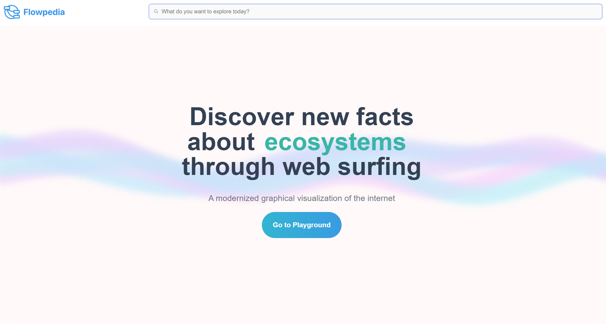

# 🏆 HackMIT Prize: Best Truth-Seeking Agent 🏆
Sponsored by Paradigm

## Inspiration
Initially, we were inspired by our studies while learning mathematics and computer science -- the topics were very broad but had many areas of expertise to focus on, so google searches usually ended up being elementary and not applicable to our studies, ultimately taking many many searches in order to really find the insights we wanted to learn. After collecting user research from 30+ university students, we realized that this was not just a problem limited to just us, so we decided to pursue this project and create a tool to address this challenge. As this is problem that students face globally (based on our user research), we decided to target university students in particular that they would be able to do deep dives into their newfound niches without being distracted by the surface level concepts that search engines like Google usually recommends due to their algorithm.

## What it does
Our project is a graphical search engine that allows users to search for any topic they want to learn, and then branch off into categories to quickly narrow down their search. + visualize the findings that are relevant to what they're interested to learn.

## How we built it
We first conducted user research, both through user surveys (30+ responses) as well as research through secondary sources. Designs were created in Figma. The backend was built with GO, where data is fetched from a custom LLM, and the endpoint is used for searches and their sub searches. We customized the return JSON of the endpoint to contain graph node data as well, which is integral to how the flow chart can be manipulated for the user's liking. The frontend was built with React with NextJS, TailwindCSS, and customized components. The node-to-dialog pop-up was made using custom parent classes and nesting states.

## Challenges we ran into
Learning a new language, especially GO, within 24 hours was a new challenge for our backend developer. We also ran into challenges trying to integrate our custom tree and node data structure.

## Accomplishments that we're proud of
We're proud of our entire project-building process, including designing low, medium, and high fidelity graphics on Figma; our LLM that worked so accurately; our fullstack application. Even so, we are most proud of our team working together for 24 hours without a break!

## What we learned
We learned that coding is hard... but it's the friendship made along the way that counts :))

## What's next for our project
We want to make a NFT instance for each of the searches, so that profs can get money from sharing their lecture thoughts and even tokenize their slides!

## Other Links
[Figma design (low, medium, high fidelity and user research)](https://www.figma.com/design/4IEe3Z4dFb46NaviAKL8TK/designs?node-id=40-47383&node-type=canvas&t=3lYNfNc4OG7yvErf-0)
